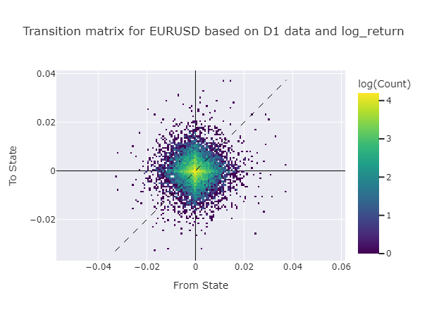
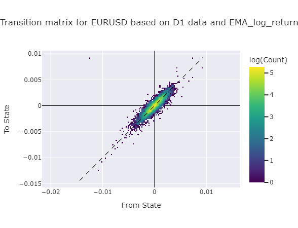
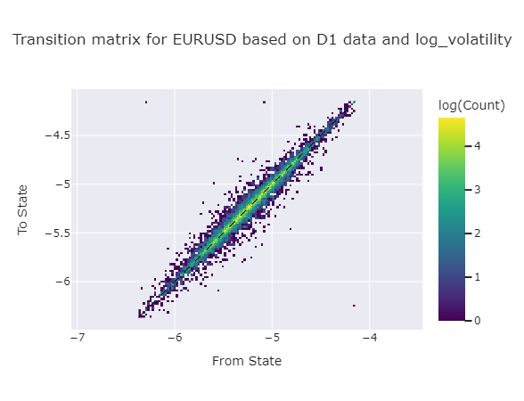

# Visualizing the Markov Chain Transition Matrix
Try this app for yourself [here](https://markov-chain-x6pemxmbwyhfeqsb965ymu.streamlit.app/).

This is a small project to visualize the Markov Chain transition matrix for financial predictions. The Markov Chain is a stochastic model describing a sequence of possible events in which the probability of each event depends only on the state attained in the previous event. In the context of this project, the transition matrix is a square matrix describing the probabilities of transitioning from one state to another. Each state is represented by a certain value of a certain variable. Different variables (features) can be used to represent the states. Some examples are:
- Return 
- Log return 
- Volatility 
- Log volatility 
- EMA of any of the above
- etc.

# How to use
Simply set the parameters required for simulation and run the code. The code will generate a transition matrix and visualize it using a heatmap. 

# Parameters
- `symbol`: *string* The symbol of the stock or forex to be used for simulation. This code uses MT5 API by default to get historical data. Yfinance can also be used.
- `timeframe`: *string* The timeframe of the data. For example, '1D' for daily data, '1H' for hourly data, etc.
- `fromNow`: *boolean* If True, the end time of the data will be the current time. If False, the end time will be read from the `endTime` parameter.
- `endTime`: *datetime* The end time of the data. This parameter is only used if `fromNow` is False.
- `Nbars`: *int* The number of bars to be used for simulation. Counted from the end time.
- `Nstates`: *int* The number of states to be used for Markov Chain transition matrix. The states will be calculated using the `feature` parameter.
- `feature`: *string* The feature to be used for calculating the states. The feature can be any of the features mentioned above.

# Example
```python
symbol = 'EURUSD'
timeframe = 'D1' 
fromNow = True
endTime = datetime.now()
Nbars = 10000
Nstates = 50
feature = 'EMA_log_return'
```
This code will generate a transition matrix for the EURUSD forex pair using daily data. The states will be calculated using the EMA of log returns. The transition matrix will have 50 states and will be calculated using the last 10000 bars.

# Results
The code will generate a heatmap showing the transition matrix. The rows of the matrix represent the current state, while the columns represent the next state. The values in the matrix represent the probability of transitioning from the current state to the next state.

The transition matrix for log return is shown below:


When visualizing the transition matrix for log return, we can see that the matrix is symmetric around the 0 line in both directions. This shows that regardless of any current value of log return, the most probable next value is 0, which means no change in the price. This is not particularly helpful for predicting future prices, as it is equivalent to predicting that the price will not change. However, this might be a starting point for more complex models.

The transition matrix for EMA of log return is shown below:


When visualizing the transition matrix for EMA of log return, we can see that the matrix is not symmetric around the 0 line. Interestingly, the most probable next value is roughly the same as the current value (along the line `y=x`). This is mostly due to the nature of the EMA, which gives more weight to recent values. Knowing the mathematical properties of the EMA, we can understand why the transition matrix looks like this. Again, this might not be useful for predicting future prices, as it is equivalent to predicting that the price will always go in the same direction. However, again this might be a starting point for more complex models.

The transition matrix for log volatility is shown below:

This transition matrix is again not symmetric and predicts that the volatility will go in the same direction as the current volatility. This again comes down to the nature of the log volatility, which is calculated using this formula:
```python
data['volatility'] = data['log_return'].rolling(20).std()
data['log_volatility'] = np.log(data['volatility'])
```
Although this equation does not give more weight to recent values, it uses rolling window to calculate the standard deviation, which might be the reason for this transition matrix.

# Future Work
Probably, Markov Chain is too simple to predict financial prices. The main assumption of Markov Chain is that the future state only depends on the current state. This is not true for financial prices, as they are influenced by many factors. 

`Markov chain 2D.py` is a more complex version of the code, which uses 2D Markov Chain to make transition matrix. This code uses two features to calculate the states and transition matrix. The main problem with using more than one feature is that visualization becomes more complex. The whole idea of this small project is to visualize the transition matrix, and gain insights from it. Using more than one feature makes it harder to visualize the transition matrix.